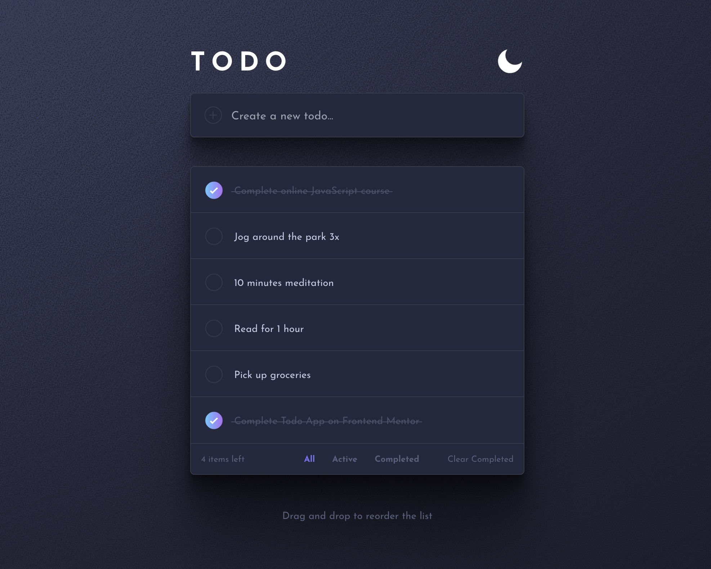

# Frontend Mentor - Todo app solution

This is a solution to the [Todo app challenge on Frontend Mentor](https://www.frontendmentor.io/challenges/todo-app-Su1_KokOW). Frontend Mentor challenges help you improve your coding skills by building realistic projects. 

## Table of contents

- [Overview](#overview)
  - [The challenge](#the-challenge)
  - [Screenshot](#screenshot)
  - [Links](#links)
- [My process](#my-process)
  - [Built with](#built-with)
  - [What I learned](#what-i-learned)
  - [Continued development](#continued-development)
  - [Useful resources](#useful-resources)
- [Author](#author)

## Overview

### The challenge

Users should be able to:

- View the optimal layout for the app depending on their device's screen size
- See hover states for all interactive elements on the page
- Add new todos to the list
- Mark todos as complete
- Delete todos from the list
- Filter by all/active/complete todos
- Clear all completed todos
- Toggle light and dark mode
- **Bonus**: Drag and drop to reorder items on the list - DONE
- **Bonus**: delete each todo item individually - DONE
- **Bonus**: save the list and his state in localhost - DONE

### Screenshot

### Links

- Solution URL: [Github](https://github.com/remyboire/todolist)
- Live Site URL: [Netlify](https://remyboire-todolist.netlify.app/)

## My process

### Built with

- React
- Tailwind
- Framer-motion

### What I learned

This project was pleasant to learn more about framer-motion, which I found really amazing. I love adding a lot of motion to this project.
It was also the first time I used tailwind, and I'm blown away by the simplicity of the framework. I only used CSS to style the checkbox as it seemed to be more efficient, but I could have use tailwind as well. I also change the background to something a bit more personal.

### Continued development

I would love to add a pan option like in iOS to delete items from the list. It would be possible with framer-motion, and it would be nice to take some time to look at it.

### Useful resources

- [Tailwindcss](https://tailwindcss.com/)
- [framer-motion](https://www.framer.com/docs/) 

## Author

- Website - [Rémy Boiré](https://remy.boire.dev/?mtm_campaign=todo-list)
- Frontend Mentor - [@remyboire](https://www.frontendmentor.io/profile/remyboire)
- Twitter - [@remyboire](https://www.twitter.com/remyboire)
